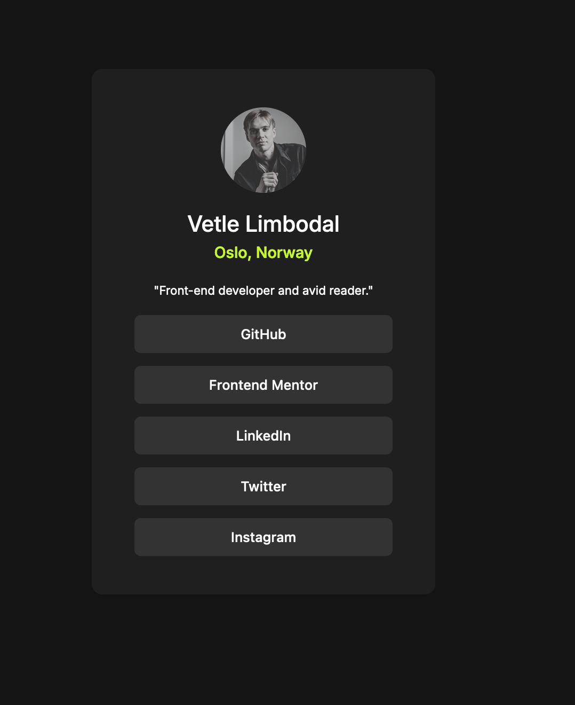

### GitHub pages
https://vlimbo.github.io/social-links-profile/

### Built with
- HTML & CSS
- Flexbox
- h1, h2, h3
- Button
- IMG

### What I learned

These projects are really good practice to get farmiliar with flexbox and its different CSS properites. I did not have any major problems or points where I got completely stuck, I feel like I'm getting a much better grasp of flexbox itself and the usecase of it. The most important part to remeber about them essentially is the fact that the content width isnt predetermined in the container itself like with grid. The width of the different "cells" are dynamic with the contents themselves, which really makes the pages felxible.

### Continued development
I need to continue to master flexbox since this is a big part of modern layouts. And also I should already now start to implement the habits of creating semantic html elements, start to make my divs more descriptive.

## Author

- Website - [Vetle Limbodal] https://substack.com/@vetlelimbo

- Twitter - [@VetleLimbodal]https://x.com/VetleLimbodal